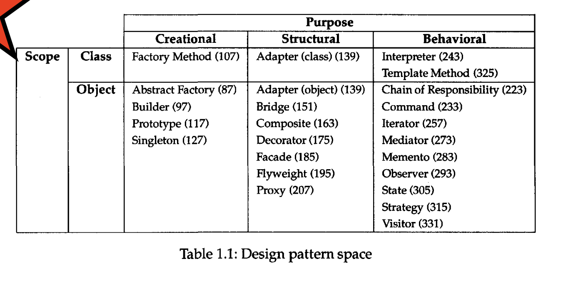

## Chapter 1 Introduction

### 1.1 What Is a Design Pattern

Christopher Alexander says,
> "Each pattern describes a problem which occurs over and over again in our environment, and then describes the core of the solution to that problem, in such a way that you can use this solution a million times over, without ever doing it the same way twice"

In general, a pattern has four essential elements:

1. ***The pattern names*** is a handle we can use to describe a design problem, its solutions, and consequences in a word or two. Naming a pattern immediately increases our design vocabulary.
2. ***The problem*** describes when to apply the pattern. It explains the problem and its context.
3. ***The solution***. The pattern provides an abstract description of a design problem and how a general arrangement of elements (classes and objects in our case) solves it.
4. ***The consequences*** are the results and trade-offs of applying the pattern.

The design patterns in this book are descriptions of communicating objects and classes that are customized to solve a general design problem in a particular context.

### 1.2 Describing Design Patterns

We describe design patterns using a consistent format. Each pattern is divided into sections according to the following template.

* Pattern Name and Classification
* Intent
* Also Known As
* Motivation
* Applicability
* Structure
* Participants
* Collaborations
* Consequences
* Implementation
* Sample Code
* Known Uses
* Related Patterns

### 1.3 The Catalog of Design Patterns & Organizing the Catalog

### 1.4 How Design Patterns Solve Design Problems

#### 1.4.1 Finding Appropriate Objects

The hard part about object-oriented design is decomposing a system into objects. The task is difficult because many factors come into play: encapsulation, granularity, dependency, flexibility, performance, evolution, reusability, and on and on. They all influence the decomposition, often in conflicting ways.

#### 1.4.2 Determining Object Granularity

Objects can vary tremendously in size and number. Design patterns address this issue as well.

#### 1.4.3 Specifying ObjectInterfaces

Design patterns help you define interfaces by identifying their key elements and the kinds of data that get sent across an interface. Design patterns also specify relationships between interfaces.

#### 1.4.4 Specifying Object Implementations

An object's implementation is defined by its class. The class specifies the object's internal data and representation and defines the operations the object can perform.

#### 1.4.5 Putting Reuse Mechanisms to Work

Most people can understand concepts like objects, interfaces, classes, and inheritance. The challenge lies in applying them to build flexible, reusable software, and design patterns can show you how.

#### 1.4.6 Relating Run-Time and Compile-Time Structures

A program's run-time structure consists of rapidly changing networks of communicating objects. In fact, the two structures are largely independent. Trying to understand one from the other is like trying to understand the dynamism of living ecosystems from the static taxonomy of plants and animals, and vice versa.

### 1.5 How to Select a Design Pattern

1. Consider how design patterns solve design problems.
2. Scan Intent sections.
3. Study how patterns interrelate.
4. Study patterns of like purpose.
5. Examine a cause of redesign.
6. Consider what should be variable in your design.

### 1.6 How to Use a Design Pattern

1. Read the pattern once through for an overview.
2. Go back and study the Structure, Participants, and Collaborations sections.
3. Look at the Sample Code section to see a concrete example of the pattern in code.
4. Choose names for pattern participants that are meaningful in the application context
5. Define the classes.
6. Define application-specific names for operations in the pattern.
7. Implement the operations to carry out the responsibilities and collaborations in the pattern.

A design pattern should only be applied when the flexibility it affords is actually needed.
